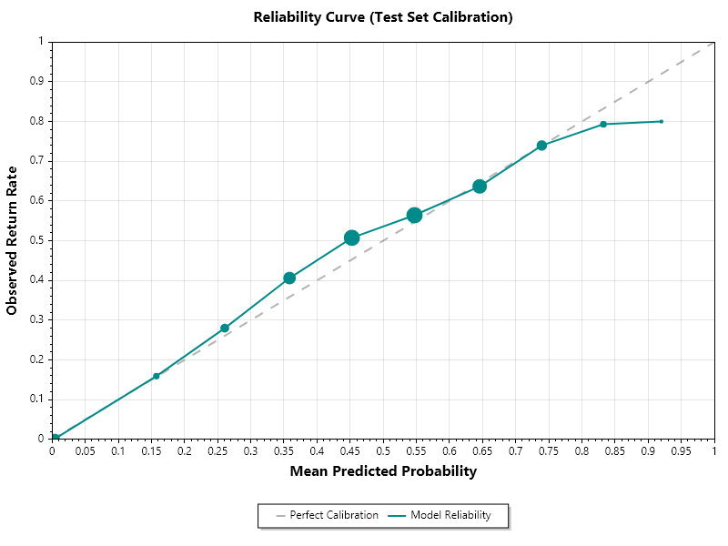
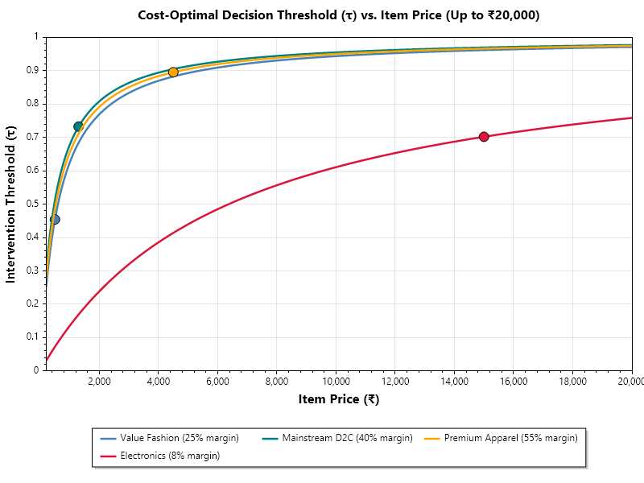

# Return-Risk Scoring: What Survives Honest Evaluation

A return-risk scorer for e-commerce orders, plus a measurement of how much of
the published performance on this dataset comes from the evaluation protocol
rather than from the model.

Built for the Razorpay AI Buildathon, Track 02 (AI Risk Manager).
C# / ML.NET.

---

## The problem

A return costs a merchant more than the refund. There's shipping out, shipping
back, handling, inventory tied up in transit, and items that can't be resold as
new. Fashion suffers the most, because sizing and expectation gaps drive returns
that other categories don't see.

If a merchant knew before dispatch which orders were likely to come back, they
could act — require prepayment, withhold cash-on-delivery, or decline the order.
But a probability is not a decision. Whether acting is worth it depends on that
merchant's margin and logistics cost.

## Data

BADS_WS_1819 — roughly 100,000 labelled orders from an online fashion retailer,
used in a 2019 in-class Kaggle competition at Humboldt University Berlin. Real
transactional data with a real `return` label.

Only the transformed version is publicly available. The raw file was licensed to
the course and isn't redistributable; the public copy is the feature-engineered
output from Engelmann (2019). That constraint shaped this project — see
[What broke](#what-broke).

Classes are artificially balanced at 48.2% by competition design.

**Split** — days 0–254 train (62,486 orders), 255–309 validation (16,177),
310–364 test (21,337). Everything below is validation except the final section.
The test set was separated at load time and read once, at the end.

## Prior work

Justin Engelmann, *Reducing E-Commerce Return Costs — A Prescriptive
Profit-Conscious Ensembling Framework* (2019), used this same dataset. He
derived a per-order optimal intervention threshold from an asymmetric cost
matrix, calibrated base models with Platt scaling, and built a profit-conscious
selective ensemble. He ranked 2nd of 118.

The cost-threshold formulation here is his, and neither of us invented it —
cost-sensitive thresholding goes back to Elkan (2001). What this repo adds is
the evaluation critique and its consequences.

---

## Finding 1 — Two leakage sources inflate reported AUC by 0.084

Same model class throughout; only the protocol and feature set vary.
Validation period.

| Configuration | AUC | PR-AUC |
|---|---|---|
| A · temporal split, target-encoded dropped | **0.6895** | 0.6632 |
| B · temporal split, target-encoded kept | 0.7575 | 0.7338 |
| C · random 5-fold CV, target-encoded dropped | 0.7268 | 0.6789 |
| D · random 5-fold CV, target-encoded kept | 0.7730 | 0.7323 |

- Target encoding: **+0.068**
- Random cross-validation: **+0.037**
- Combined: **+0.084**

**Target-encoded columns.** A conditional expectation is a column holding the
average return rate for orders like this one. It was computed over the entire
labelled set, so a training row's feature value was calculated using labels from
the evaluation period. This can't be undone without the raw data, so the only
clean option was to drop the columns.

**Random cross-validation.** Orders are timestamped, and random folds ignore
that. Some test orders happen earlier than the data the model trained on, so the
model answers questions about the past using knowledge from the future — that's
recall, not prediction. A temporal split forbids this by construction: every
training order precedes every test order, which is how the system actually runs.

Config D approximates the published protocol and lands near the reported
leaderboard score. That matters because it means this isn't a strawman — the
comparison is against a faithful reproduction of the original setup, not a
weakened version of it.

One further observation: in PR-AUC, B and D are nearly identical while C is much
lower. Once the target-encoded features are present, the protocol barely
matters — those features dominate.

## Finding 2 — Calibration was tested and deliberately left out

| Variant | AUC | Brier | ECE |
|---|---|---|---|
| uncalibrated | 0.6859 | **0.2190** | **0.0190** |
| Platt | 0.6859 | 0.2194 | 0.0286 |
| isotonic | 0.6850 | 0.2206 | 0.0322 |

The decision layer multiplies probabilities by rupees, so a score of 0.7 has to
actually mean 0.7 — otherwise every currency figure is wrong. AUC can't detect
this. It only checks ordering, and stays unchanged even if you squash every
score into a narrow band.

I tested Platt scaling and isotonic regression, and both made it worse. LightGBM
optimises log-loss, a proper scoring rule, so truthful probabilities are the
training objective rather than a side effect. There was nothing to correct, so
the calibrators fitted noise. Engelmann needed calibration because he used
AdaBoost, KNN and Random Forest — AdaBoost in particular pushes everything
toward 0.5 — while the other models he tested were fine untreated.

**Reliability, uncalibrated, validation period:**

| Bin | Count | Mean predicted | Observed | Signed gap |
|---|---|---|---|---|
| 0 | 980 | 0.0051 | 0.0061 | −0.0010 |
| 1 | 269 | 0.1564 | 0.1896 | −0.0332 |
| 2 | 757 | 0.2565 | 0.2774 | −0.0209 |
| 3 | 1852 | 0.3570 | 0.3915 | −0.0345 |
| 4 | 3640 | 0.4539 | 0.4830 | −0.0291 |
| 5 | 4129 | 0.5488 | 0.5587 | −0.0099 |
| 6 | 3026 | 0.6458 | 0.6606 | −0.0148 |
| 7 | 1296 | 0.7390 | 0.7276 | +0.0114 |
| 8 | 220 | 0.8299 | 0.7818 | +0.0481 |
| 9 | 8 | 0.9182 | 0.7500 | +0.1682 |



*Marker size is proportional to bin count. The curve sits above the diagonal
through the middle of the range — the model under-predicts where most orders
are.*

Bins 1–6 are all negative — a consistent under-prediction across the middle of
the range, where roughly 13,000 of 16,000 orders sit. That's base-rate drift,
not miscalibration: the training period returns at 46.7% and validation at
50.6%, so the model learned the earlier, lower rate. Platt can't fix it either,
because it's fitted on days 204–254, still inside the training period and
carrying the same stale rate.

Bin 9 shows a large gap but contains 8 orders. That's small-sample noise, not a
finding.

## Finding 3 — Intervention only pays where margins are thin

```
E[profit | allow]     = (1 − p) · m · v  −  p · C
E[profit | intervene] = 0
⇒ intervene when  p > τ(v) = m·v / (C + m·v)
```

where `v` is item price, `m` the gross margin rate, and `C` = 2 × shipping +
handling.

τ rises with item price because the margin at stake scales with the order while
logistics cost stays roughly fixed. On a cheap item there's little margin to
protect, so a modest suspicion justifies acting. On an expensive one, blocking
throws away a lot to avoid a little, so it takes much stronger evidence. A
₹1,299 order at 40% margin gives τ ≈ 0.73; a ₹4,500 order at 55% gives τ ≈ 0.90.



*Dots mark each profile's median order value. The three fashion curves nearly
overlap — τ at a given price is driven mostly by margin rate — but the profiles
sit at very different points along them, because their typical order values
differ by 30×. Electronics separates because an 8% margin against a ₹510 return
cost is a different ratio entirely.*

Average profit per order, validation period:

| Profile | median τ | never | fixed 0.5 | best global | cost-optimal | intervention rate |
|---|---|---|---|---|---|---|
| Value fashion (₹499, 25%) | 0.454 | −₹11.33 | ₹6.07 | ₹8.39 | **₹12.28** | 65.0% |
| Mainstream D2C (₹1,299, 40%) | 0.732 | ₹172.58 | ₹100.22 | ₹172.79 | ₹173.22 | 7.5% |
| Premium apparel (₹4,500, 55%) | 0.895 | ₹1,132.94 | ₹583.37 | ₹1,132.99 | ₹1,132.75 | 0.3% |
| Electronics (₹15,000, 8%) | 0.702 | ₹362.59 | ₹219.19 | ₹363.35 | ₹368.10 | 11.5% |

Three results follow:

1. On value fashion, per-order thresholds earn ₹12.28 per order against ₹8.39
   for the best possible single cutoff — 46% more. The global cutoff was allowed
   to tune on the evaluation data itself, so that's the strongest version of
   that baseline, not a weak one.
2. Intervention swings value fashion from loss-making to profitable.
3. Premium apparel gains nothing. Cost-optimal comes out fractionally below
   never intervening, at a 0.3% intervention rate. At 55% margin the system is
   worth nothing there, so selling this capability to a high-margin merchant
   would be selling nothing. Being able to name who shouldn't buy it is part of
   the result.

A fixed 0.5 threshold destroys value everywhere except the thinnest margins —
₹72 per order on mainstream D2C, ₹550 on premium apparel.

## Finding 4 — Selective labeling degrades the model, and a cheap mitigation recovers most of it

Blocked orders never ship, so their outcome is never observed. Retraining then
sees only the orders the model itself allowed — it selected its own training
data. Errors in the blocked region never get corrected, so they become
self-confirming. This is known in credit scoring as reject inference.

Five sequential rounds over the validation period, value-fashion economics,
every round scored on the untouched test period:

| Arm | Seed | R1 | R2 | R3 | R4 | R5 |
|---|---|---|---|---|---|---|
| Deployed (no holdout) | 0.6784 | 0.6787 | 0.6759 | 0.6866 | 0.6865 | 0.6868 |
| Holdout 5% | 0.6784 | 0.6792 | 0.6744 | 0.6871 | 0.6893 | 0.6904 |
| Holdout 10% | 0.6784 | 0.6760 | 0.6777 | 0.6862 | 0.6893 | 0.6904 |
| Oracle (label all) | 0.6784 | 0.6783 | 0.6755 | 0.6914 | 0.6919 | 0.6933 |

The gap between the deployed arm and the oracle is +0.0065. The ordering is
exactly as theory predicts, but the magnitude is modest. Both holdout arms
recover about 55% of the loss, and 5% does as well as 10%, so the cheaper
mitigation is enough at this horizon. Rounds 1 and 2 show no separation between
arms because the day-span split produced uneven volumes
(1791/1846/4784/4673/3083 orders), so the early rounds contribute too few labels
to move the model.

### Sensitivity — what the effect depends on

| Seed window | Seed rows | Rounds | Deployed | Oracle | Gap |
|---|---|---|---|---|---|
| Days 0–254 | 62,486 | 5 | 0.6871 | 0.6865 | **−0.0007** |
| Days 0–254 | 62,486 | 15 | 0.6858 | 0.6918 | +0.0060 |
| Days 195–254 | 10,884 | 5 | 0.6784 | 0.6844 | +0.0060 |
| Days 195–254 | 10,884 | 15 | 0.6776 | 0.6844 | +0.0069 |
| Days 225–254 | 4,397 | 5 | 0.6701 | 0.6786 | +0.0085 |
| Days 225–254 | 4,397 | 15 | 0.6658 | 0.6808 | **+0.0150** |

The effect more than doubles as the seed shrinks and the rounds grow — from
+0.0065 to +0.0150 — and both dials move it independently. The full-seed,
five-round cell came out at −0.0007, effectively zero: the effect vanishes when
the model starts with abundant clean history. That's the boundary condition of
the finding and it belongs in the table.

What this supports is a narrower claim than "selective labeling breaks models" —
it doesn't hurt a mature model, it hurts a new deployment. A merchant launching
with a month of data sits in the bottom row.

## Final evaluation — untouched test set

Read once, after everything above was settled. No tuning followed.

| Configuration | Test AUC | Test PR-AUC |
|---|---|---|
| A · honest (target-encoded dropped) | **0.6784** | 0.6564 |
| B · leaked (target-encoded kept) | 0.7520 | 0.7321 |

The leakage gap holds on test at **+0.0736**, against +0.068 on validation. Both
configurations dropped about 0.011 from validation to test, consistent with
drift over a period further from training.

**Operational metrics, mainstream D2C at the cost-optimal threshold:**

| | |
|---|---|
| Intervention rate | 10.68% |
| Precision | 0.6082 (1,386 of 2,279 interventions correct) |
| Recall | 0.1280 (1,386 of 10,832 returns intercepted) |

Recall is low by design, not by failure. At 40% margin the threshold sits near
0.73, so the system only intervenes when it's close to certain — blocking a
genuine sale costs far more than absorbing a return. A model tuned for high
recall would intervene constantly and lose money: the fixed-0.5 rule has much
higher recall and earns ₹72 per order less. If high recall is what a merchant
wants, that's the value-fashion profile, where τ ≈ 0.45 and the system
intervenes on 65% of orders.

---

## The scoring API

`ReturnRisk.Api` is an ASP.NET Core service that loads the trained model at
startup and exposes a single endpoint.

**POST `/score`** takes the 62-element feature vector, the item price, and a
merchant profile (median order value, margin rate, shipping per leg, handling).
It returns the model's probability, the τ computed for that specific order and
merchant, the allow/intervene decision, and the expected profit of each choice.

Returning both expected profits rather than a bare verdict is deliberate: a
support agent handling a blocked order needs to see the reasoning, not just the
outcome.

The endpoint validates the feature-vector length up front and returns 400 on a
mismatch, rather than letting the model produce a plausible score from the wrong
number of inputs. Scoring goes through `PredictionEnginePool`, since
`PredictionEngine` is not thread-safe and a web service handles requests
concurrently.

The trained model (`returnrisk-model.zip`, 182 KB) is committed, so the API runs
from a clone without regenerating it.

### Latency

Measured over 1,000 iterations after 100 discarded warm-up calls, on one machine
with client and server as separate local processes.

| Tier | p50 | p99 |
|---|---|---|
| In-process (model + τ) | 0.004–0.007 ms | 0.005–0.042 ms |
| HTTP round trip (incl. JSON) | 0.56–1.64 ms | 1.5–19.7 ms |

Ranges span three runs. The HTTP tail was unstable — p99 varied by more than 10×
between runs — and a single-machine benchmark where both processes compete for
the same cores cannot measure tail latency reliably, so I'm reporting the spread
rather than picking a favourable number.

What holds regardless: in-process scoring costs single-digit microseconds. The
model is not the bottleneck in a checkout budget measured in tens of
milliseconds; the network path is.

---

## What broke

**The ten target-encoded column names were wrong.** I typed them from memory
instead of reading the header. Nothing matched, so nothing was excluded from the
feature set. That means configs A and B would have used identical features, the
leakage gap would have read as zero, and I'd have reported "no leakage" as a
finding. What caught it was a check I'd put before the filtering: verify the ten
names exist in the header, throw if any are missing. Instead of a wrong answer I
got an exception listing all ten.

The lesson is that a silent filter failure is worse than a crash — it produces a
result that looks correct. Now I validate schema assumptions against the actual
source before processing rather than trusting names I typed.

**The raw data isn't public.** I wanted `BADS_WS_1819_known.csv` with the
original columns, but it isn't available. The Kaggle competition page is a dead
InClass page with placeholder dates, and the only version obtainable is the
transformed file, which has the target encodings already baked in. That meant I
couldn't rebuild the features cleanly myself. I didn't go looking for a private
copy either — the retailer's data was licensed to the course and isn't mine to
redistribute.

I stopped searching and worked with what I had. That constraint is what
redefined the project: I'd planned to build a return-risk scorer, and being
stuck with leakage baked into the file is what turned it into a leakage
measurement instead. The thing I couldn't remove became the thing I measured.

**My planned differentiator was already published.** It was cost-optimal
thresholding — computing the intervention threshold per order from merchant
economics instead of using a fixed cutoff. While reading through the repository
I'd downloaded, I found Engelmann's term paper. He had done exactly that on this
dataset in 2019: per-order optimal threshold from an asymmetric cost matrix,
Platt calibration, a profit-conscious ensemble, ranked 2nd of 118.

Rather than pretend I hadn't seen it, I read his method and found two choices
that inflated his numbers: random cross-validation on timestamped data, and
target-encoded features computed across the whole labelled set. I kept the cost
model and made measuring those two effects the actual contribution.

Because I caught the overlap myself rather than a reviewer catching it after
submission, I could pivot from accidental duplication to replication and
critique. Had it surfaced later, the same work would have read as uncredited
reuse.

**ML.NET schema mismatch.** In the simulation, each round adds newly observed
orders to the training set. There's no clean way to append rows to an
`IDataView`, so I materialised everything into a `List<OrderData>` and rebuilt it
with `LoadFromEnumerable`. My `OrderData` class declared `[VectorType]` on
`float[] Features` with no size, so ML.NET treated it as a vector of unknown
length. LightGBM needs to know how many features it's getting before it can
train, so it refused with a schema mismatch.

The CSV path had worked because `TextLoader` knows there are exactly 62 feature
columns and gives `Features` a fixed size. Rebuilding from a C# list lost that —
the class never says how long the array is. The quick fix was `[VectorType(62)]`,
but that's a hardcoded number that would have broken silently for the
CE-included configuration, which has 72 features. Instead I built a
`SchemaDefinition` that reads the vector size from the source view's schema and
sets it at runtime, so the size always matches the data it was handed.

The takeaway: don't hardcode schema metadata. Deriving the vector size from the
runtime data contract keeps the pipeline from breaking silently when the feature
set changes.

## Limitations

**European data, Indian economics.** The dataset is European orders priced in
Euros, which I adapted using assumed Indian margins and logistics costs. The
spread of prices is real; the currency amounts are approximations, not market
figures.

**Artificially balanced classes.** The competition balanced the data to roughly
48% returns, higher than reality. The financial figures should be read as
relative comparisons between decision rules, not as profit forecasts.

**Post-delivery returns, not RTO.** The model predicts standard post-delivery
returns rather than the Indian return-to-origin pattern driven by failed
addresses and impulse cancellations. The framework transfers; the trained model
doesn't.

**Intervention assumed perfectly effective.** I modelled a blocked order as
simply not happening. In reality a prepayment nudge converts some customers and
loses others, and measuring that needs randomised treatment data this dataset
doesn't contain.

**Inherited feature engineering.** The 62 features are Engelmann's, minus the
ten target-encoded ones. Without the raw data I couldn't build my own.

**One test split, read once.** A single chronological test period, no rolling
windows or repeated resampling, so there are no confidence intervals around
these numbers.

## Operational considerations

Three things a production deployment would have to solve that this study
doesn't. They're design problems rather than missing features, so they're
reasoned through here rather than built.

### Training/serving skew

In training, the historical aggregations were already sitting in the static
file. I trained on `known_transformed.csv`, where all 62 features were
precomputed — customer lifetime value, days since last purchase, account age,
size deviation from that user's average, all ready.

At live checkout the API only receives the raw cart payload: customer ID, item
ID, price, category. To produce the 62 inputs it would have to query past order
tables, run the aggregations, and compute deviations against a baseline — all
inside a sub-50ms window.

The exposure is that the offline feature generation would have to be rewritten
in the backend. If the two definitions diverge even subtly — the offline script
counting cancelled orders toward LTV while the API doesn't, or recency measured
from order placement in one and warehouse dispatch in the other — the model
receives inputs that don't match what it learned from. This doesn't crash. It
degrades calibration and accuracy silently.

This project is especially exposed because it doesn't rely on simple item specs;
it relies mostly on multi-order historical customer behaviour. The fix would be
a centralised feature store — an online cache paired with offline storage — or a
single shared transformation library, so training-set generation and production
scoring use the exact same code.

### Cold start

The model relies heavily on historical user habits and product return rates. A
first-time customer has empty historical features, and a newly listed item has
no sales history. Left unhandled, a zero-valued feature reads as "zero
historical returns" or "zero LTV" rather than "unknown" — so the model treats an
unknown customer as a known-good one.

A production approach would work in three levels. **User cold start:** impute
missing history with population-level or segment-level medians rather than raw
zeros. **Item cold start:** fall back to brand or sub-category aggregates until
the specific SKU gathers enough transaction volume. **Decision guardrail:** for
cold-start orders, tighten the intervention threshold or defer intervention
entirely, to avoid friction on a customer's first checkout.

### Delayed feedback and the intervention loop

Unlike click-through prediction, where feedback arrives in seconds, a return
takes days to materialise. An order placed today delivers in four days, carries
a 15–30 day return window, and then needs reverse logistics — so ground truth
matures 30 to 45 days after the scoring event.

That creates a retraining trap. If you retrain on recent orders — say the last
two weeks — every order that hasn't been returned *yet* looks like a kept order,
which heavily undercounts actual returns and skews the training data. Retraining
datasets have to enforce an observation lag window.

There's a second-order problem too. When the system intervenes it actively
alters user behaviour. If an intervention successfully prevents a return, the
recorded label is 0 — and naive retraining reads that as "this order was
naturally low risk," so the model unlearns the very risk it just mitigated. The
fix is to log intervention treatment alongside the raw prediction, and maintain
an untreated holdout control group to monitor baseline return rates.

That control group is the same mechanism as the 5% holdout in Finding 4, arrived
at from a different direction: there it preserved label coverage in the blocked
region, here it preserves an untreated baseline. One holdout serves both.

### Also outstanding

A production deployment would additionally need: defined fallback behaviour when
the model is unavailable (allow or block, and which costs less); merchant
override lists sitting above the model; bounds and review on the margin and
shipping inputs that drive τ, since those are merchant-supplied and drive
automated money decisions; monitoring on intervention rate rather than AUC,
because the realistic failure is a rate spike nobody notices for days; shadow
deployment before any model swap; and an explainability path so support can
answer why a specific order was blocked. Each needs design work not done here.

## Running it

Two projects.

**`ReturnRisk`** — the console app that runs all experiments, trains the model,
generates the charts, and benchmarks latency:

```
dotnet run --project ReturnRisk
```

Requires `known_transformed.csv` in the working directory. It isn't committed —
it's the retailer's data, not mine to redistribute. It's available from
Engelmann's repository, linked below.

**`ReturnRisk.Api`** — the scoring service:

```
dotnet run --project ReturnRisk.Api
```

Runs from a clone without the CSV, since the trained model is committed. Swagger
is enabled for testing the endpoint; the console app prints a sample feature
vector you can paste in.

## References

- Engelmann, J. (2019). *Reducing E-Commerce Return Costs — A Prescriptive
  Profit-Conscious Ensembling Framework.* Humboldt-Universität zu Berlin.
  https://github.com/justinengelmann/Business-Analytics-and-Data-Science-WS1819
- Elkan, C. (2001). *The Foundations of Cost-Sensitive Learning.* IJCAI.